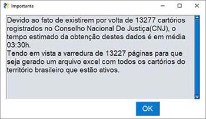
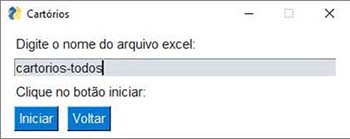
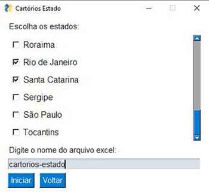
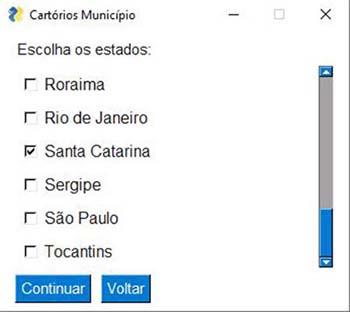
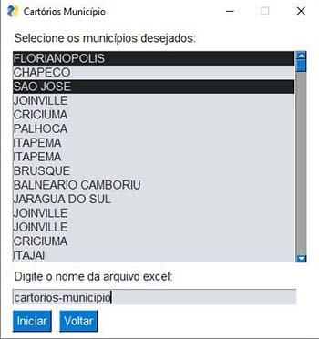
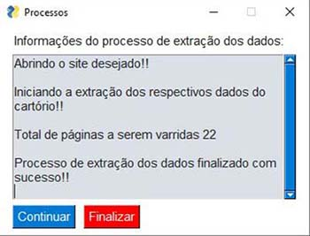
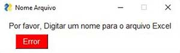
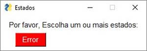
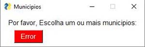

# Projeto_Cartorio_Extrajudicial
<p align="justify">Este é um programa Python com interface gráfica desenvolvida com PySimpleGUI para automatizar a extração de informações de cartórios do site do Conselho Nacional de Justiça (CNJ). Ele permite que o usuário escolha critérios de extração, como estados, municípios ou todos os cartórios, e exporta os dados para um arquivo Excel.</p>

## 🛠️ Tecnologias Utilizadas
Principais tecnologias usadas:
Selenuim - PysimpleGUI - openpyxl

## 📌 Status do Projeto
 
✅ *Projeto concluído*  ✅ 

## Licença
Este projeto é licenciado sob a licença MIT. Consulte o arquivo [LICENSE](LICENSE) para obter detalhes.

## 🔧 Instruções de Uso

### 📋 Instalação Das Dependências
Para instalar as dependências do projeto, execute o seguinte comando:
```bash
pip install -r requirements.txt
```
### ⚙️ Iniciando a Aplicação
Para iniciar a aplicação de extração de informações de cartórios, execute o seguinte comando:
```bash
python app.py
```
## 🚀 Instruções de uso
#### Página Inicial
Apresenta a tela inicial do programa com opções para escolher o tipo de extração:


#### Página Geral Cartórios
Permite ao usuário extrair dados de todos os cartórios e especificar o nome do arquivo Excel.





#### Página Cartórios Estado
Permite ao usuário escolher estados para extrair dados e especificar o nome do arquivo Excel.



#### Página Cartórios Município
Permite ao usuário escolher estados para extrair dados de municípios e continuar para a próxima etapa.



Permite ao usuário selecionar municípios para extrair dados e especificar o nome do arquivo Excel.



#### Página Processos
Apresenta informações sobre o processo de extração e permite ao usuário continuar ou finalizar o programa.



### 🚨 Tipos de Erros

**Quando o não é fornecido um nome para planilha:**



**Quando não é feita a escolha de um estado:**



**Quando não é feita a escolha de um município:**



**Aviso para que não seja executado mais de uma extração por vez:**


